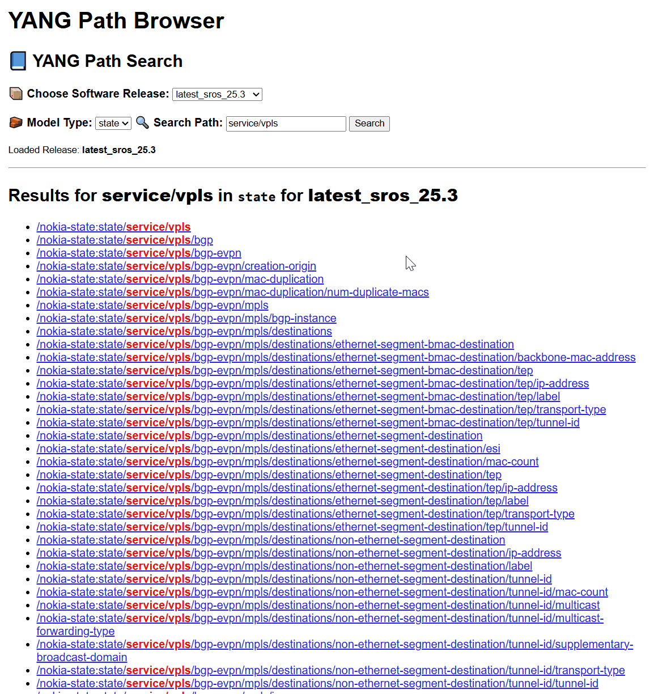
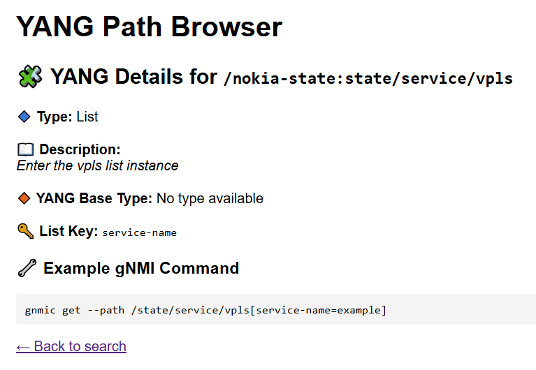

# 🧭 YANG Path Browser

**YANG Path Browser** is a developer tool to explore and test **YANG paths** from Nokia SR OS models. It provides metadata for any path (leaf, list, container), and generates example **gNMI** commands ready for use in network testing tools like **Robot Framework**. For SR-Linux the official yang path browser can be found here: [https://yang.srlinux.dev/](https://yang.srlinux.dev/)

> 📌 Supports both `state` and `conf` models. Built on FastAPI + Jinja2.

---

## ✨ Features

- 🔍 **Interactive path search** and metadata inspection  
- 📂 **Auto-processing** of all local YANG releases in `7x50_YangModels/`  
- ⚠️ **Partial match detection** with closest node fallback  
- 🧩 **Type classification**: container, list, leaf  
- 🔧 **Auto gNMI command preview**  
- 🔁 **Lazy loading** and background model preprocessing  
- 🧠 **Persistent auto-reload** of last loaded model (fast startup)
- 📊 **Release status tracking** (`/status` endpoint and visual indicator)

---




---

## ⚙️ Setup (with `venv`)

### 1. Clone and set up Python environment

```bash
git clone https://github.com/DerSchiman/nokia_7x50_yang_path_browser.git
cd nokia_7x50_yang_path_browser

# Create a virtual environment
python3 -m venv venv
source venv/bin/activate

# Install requirements
pip install -r requirements.txt
```

### 2. Run the app

```bash
uvicorn path_browser:app --reload
```

📡 Open in browser: [http://127.0.0.1:8000](http://127.0.0.1:8000)

---

## 📥 Where to Get Nokia YANG Models

All public Nokia SR OS YANG models are here:  
🔗 https://github.com/nokia/7x50_YangModels

To download a specific release (e.g. `latest_sros_22.10`) without cloning the full repo:

1. Go to:  
   https://download-directory.github.io/

2. Paste this URL:  
   ```
   https://github.com/nokia/7x50_YangModels/tree/master/latest_sros_22.10
   ```

3. Download and unzip the folder into `7x50_YangModels/`

---

## 🚀 How to Use the Tool

### 🧳 Load Model Folders

1. Place downloaded folders into the `7x50_YangModels/` directory  
2. Start the tool  
3. Open the web UI at [http://127.0.0.1:8000](http://127.0.0.1:8000)  
4. All releases will be preprocessed automatically in the background  

🗂 Expected input structure:

```
nokia-combined/nokia-state.yang  
nokia-combined/nokia-conf.yang  
```

### 🔍 Search & Inspect Paths

- Use the **search bar** to find nodes (e.g. `sap-egress`)  
- Click on a result to view:
  - 📦 Path
  - 📄 Description
  - 📐 Type (leaf/list/container)
  - 🔑 Keys (for lists)
  - 🔧 gNMI example

---

## 💡 gNMI Command Preview

For each YANG node, the tool auto-generates a CLI example:

```bash
gnmic get --path /state/qos/sap-egress[sap-egress-policy-name=example]
```

🧠 You can copy this directly into gNMI automation or adapt it for config testing.

---

## 🤖 Using YANG Info for Robot Framework

If you write tests in Robot Framework using gNMI `Get` or `Set`, it's essential to understand the **YANG node type**:

| Type       | Description                                                                 | gNMI Return | Robot Use Hint                                                  |
|------------|-----------------------------------------------------------------------------|-------------|------------------------------------------------------------------|
| `container`| A grouping node, contains sub-nodes but not data itself                     | ⛔ No value | Traverse into it, don’t expect a return value                    |
| `list`     | A repeatable set of fields, requires a key                                  | ✅ Multiple  | Use key(s) like `[id=...]` to index; loop or assert lists        |
| `leaf`     | Holds a scalar value (string, int, bool, etc.)                              | ✅ Single   | Use in `Get` or `Set`, this is where you test actual values      |

---

## 🧪 Dev CLI (flattening only)

To only generate flattened path files from a given release folder:

```bash
python path_browser.py --yang-dir /your/model/folder
```

---

## 🧼 Cleanup

To delete all generated `.yin` and `.txt` files and restart fresh:

```bash
curl -X POST http://127.0.0.1:8000/cleanup
```

---

## 🔧 REST API Endpoints

- `GET /` — Web UI  
- `GET /yang_details?path=...&release=...` — Get metadata  
- `GET /status` — JSON status of model loading  

---

## 🧠 Credits

Built by [@DerSchiman](https://github.com/DerSchiman) using:
- Python / FastAPI
- Jinja2
- `pyang`
- Nokia SR OS YANG Models
